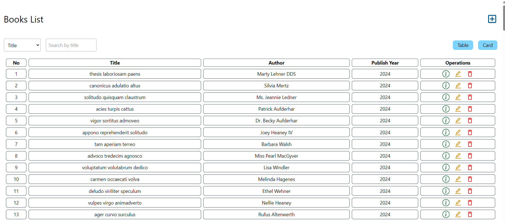
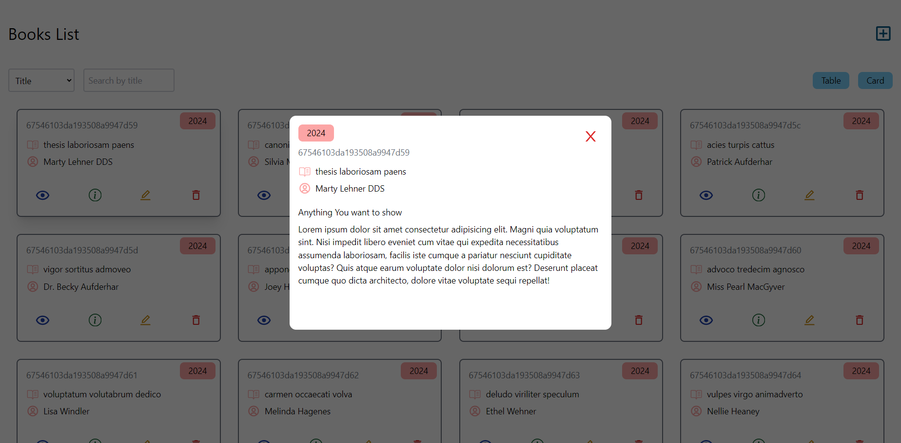

# 📚 Books Store App

Welcome to the **Books Store App**! This project is a sleek and user-friendly application for managing a collection of books. Whether you’re a book enthusiast, librarian, or developer looking for inspiration, this app has something for everyone!

## 🚀 Features

### Core Functionalities:

- **View All Books**:
  - Display books in either a **table view** or **card view** for flexible browsing.
- **Search with Precision**:
  - Find books by **title**, **author**, or **publish year** using the intuitive search bar and dropdown menu.
- **Add New Books**:
  - Easily add books with their details using the creation page.
- **Detailed Book View**:
  - View comprehensive details of a specific book, including creation and update timestamps.

### Highlights:

- Dynamic UI for switching between views (table or card).
- Real-time filtering of books based on user input.
- Responsive design for seamless use on desktops and mobile devices.

## 🛠️ Technologies Used

- **Frontend**:
  - React.js
  - React Router DOM
  - Tailwind CSS for styling
  - React Icons for visuals
- **Backend**:
  - Node.js and Express (API used for fetching book data)
- **Utilities**:
  - Axios for HTTP requests

## 🎨 Screenshots

### Home Page

- Browse books in table or card format.
- Quickly search with dynamic filtering.

### Book Details Page

- View a book’s details in an organized layout.

### Add Book Page

- Add a new book with minimal effort.






## 🧰 Installation & Setup

1. **Clone the Repository**:

   ```bash
   git clone (https://github.com/M0ShalaanBook-Store--MERN-Stack-.git)
   ```

2. **Navigate to the Project Directory**:

   ```bash
   cd books-store-app
   ```

3. **Install Dependencies**:

   ```bash
   npm install
   ```

4. **Run the App (frontend)**:
   ```bash
    cd frontend && npm run start
   ```
5. **Run the Database (backend)**:
   ```bash
    cd backend && npm run server
   ```
6. **Backend Setup**:
   Ensure you have the backend running on `http://localhost:5555` with the following endpoints:
   - `GET /books` - Fetch all books.
   - `GET /books/:id` - Fetch a specific book by ID.

## 🌟 Key Files

### Frontend Structure

- **`/components`**:
  - Reusable UI components like `BooksTable`, `BooksCard`, `BackButton`, and `Spinner`.
- **`/pages`**:
  - `Home.js`: Displays the books list and search functionalities.
  - `ShowBook.js`: Displays details of a specific book.
- **`App.js`**:
  - Main app component with routing logic.

## 🏗️ Future Enhancements

- **Pagination**:
  - Improve performance by paginating the book list.
- **Book Editing**:
  - Add functionality to update book details.
- **Backend Integration**:
  - Expand backend for additional operations like deleting books.

---

Happy coding and happy reading! 📖✨
